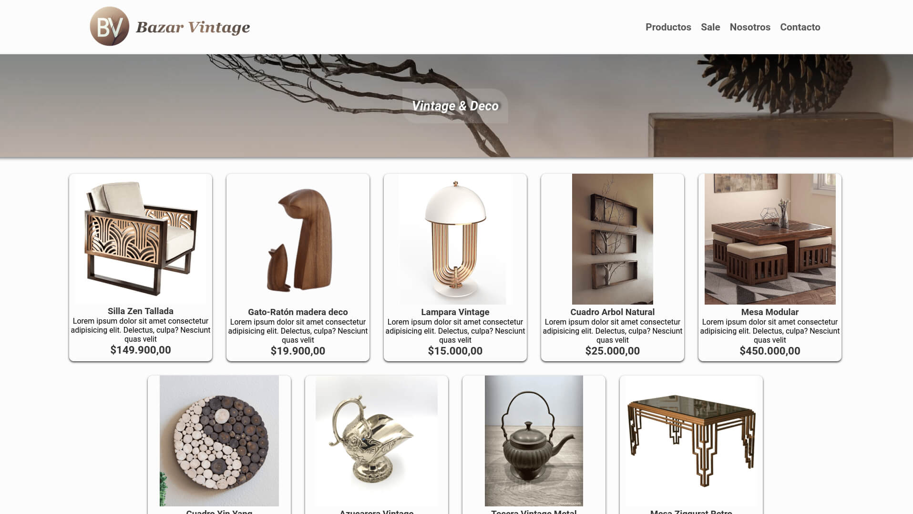

# Bazar Vintage

Bienvenido al repositorio del proyecto **Bazar Vintage**. En este sitio web que muestra una colección única de productos de decoración y bazar vintage o antiguo. Nuestro objetivo es ofrecer una experiencia única a los amantes del estilo vintage, proporcionando una cuidadosa selección de artículos que agreguen un toque de nostalgia y estilo a cualquier hogar.

## Capturas de pantalla:

### Desktop

  

### Mobile

## Características principales:

- **Explora una Colección Única:** Descubre una amplia variedad de productos cuidadosamente seleccionados, desde muebles hasta accesorios decorativos, todos con un encanto vintage inigualable.

- **Diseño Intuitivo:** Navega por nuestro sitio de forma fácil y sencilla gracias a un diseño intuitivo y una interfaz de usuario amigable.

- **Contacto:** Contamos con un formulario para consultas sencillo de usar.

## Recursos y Herramientas

- La maquetación se realizó con sobre HTML 5 con CSS **FlexBox**.
- El sitio cuenta con 5 páginas totalmente responsive (Desktop, Tablet, Mobile)
  - Home, Products, Sale, Contact y About
- El formulario de contacto incluye la posibilidad de cargar una imágen en formato jpg o png y se valida por JavaScript.
- Se utilizan transiciones y animaciones de distitnto tipo en botones, cards, nav y footer.
- Se utilizan fuentes de Google Fonts e íconos de Font Awesome.
- El logo fue realizado por la AI *DALL-E 3*.
- Se agregó un Favicon a todas las páginas del proyecto.

## Contribuciones:

Si deseas proponer cambios nos encantaría recibir tus contribuciones para mejorar y hacer crecer este proyecto. Si tienes alguna idea, sugerencia o corrección, no dudes en enviar un pull request.

¡Gracias por pasar!
